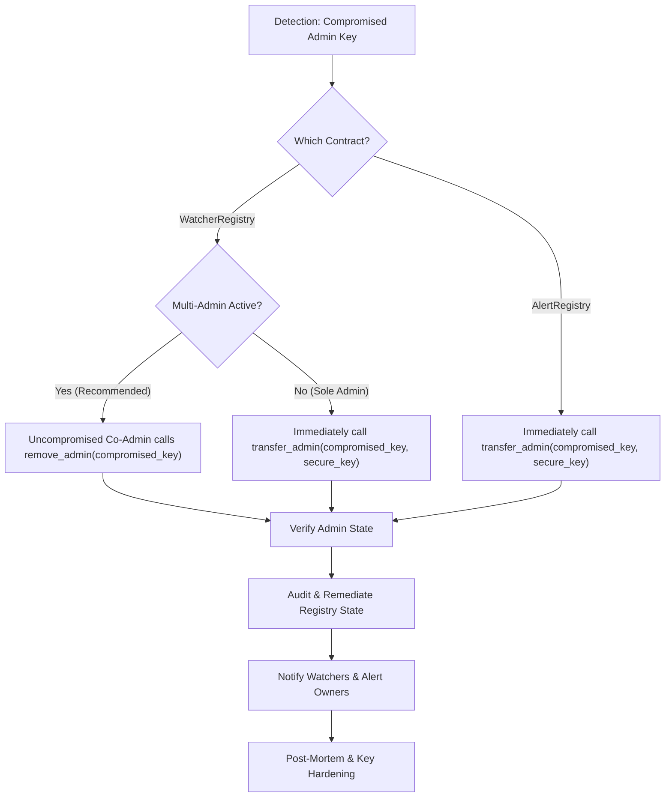

# Incident Response Runbook: Compromised Admin Key

This runbook defines the emergency response procedure for operators of the **TxWatch** smart contracts (`AlertRegistry` and `WatcherRegistry`) in the event that an administrative private key is suspected or confirmed to be compromised.

---

## 1. Threat Model & Blast Radius

Understanding what an attacker can and cannot do with a compromised admin key determines the containment strategy:

### AlertRegistry
* **Admin capabilities:**
  * Rotate the admin key via `transfer_admin`.
  * Update the per-owner alert limit via `set_per_owner_alert_limit`.
  * Change the linked `WatcherRegistry` contract address via `set_watcher_registry`.
  * Delete any alert from storage via `remove_alert_by_admin`.
* **What an attacker CANNOT do:**
  * Register new alerts under a user's address (requires user `owner.require_auth()`).
  * Modify existing user alerts, rules, or webhook URLs (requires user `caller.require_auth()`).
  * Impersonate alert owners.

### WatcherRegistry
* **Admin capabilities:**
  * Add new admins to the admin set via `add_admin`.
  * Remove admins from the admin set via `remove_admin`.
  * Overwrite the entire admin set with a single key via `transfer_admin`.
  * Authorize watcher nodes via `register_watcher`.
  * Deauthorize watcher nodes via `remove_watcher`, `replace_watcher`, or `clear_all_watchers`.
* **What an attacker CANNOT do:**
  * Remove the last remaining admin (prevented on-chain by `ContractError::LastAdmin`).
  * Forge cryptographic signatures of watcher nodes.

---

## 2. Phase 1: Detection & Signal Identification

An admin key compromise may be detected through several signals:

1. **On-Chain Event Alerts:**
   * `AlertRegistry`:
     * `("admin", "transfer")` — emitted whenever `transfer_admin` is executed.
     * `("alert", "remove")` — emitted when `remove_alert_by_admin` deletes an alert.
   * `WatcherRegistry`:
     * `("admin", "init")`, `("admin", "add")`, `("admin", "remove")`, `("admin", "transfer")`.
     * `("watcher", "register")`, `("watcher", "remove")`, `("watcher", "replace")`.
2. **Off-Chain Telemetry Anomalies:**
   * Watcher nodes reporting unexpected deauthorization or inability to read gated alert queries (`ContractError::NotAWatcher`).
   * Alert owners reporting sudden deletion of their configured alerts.
3. **Out-of-Band Disclosures:**
   * Secret leak detected in CI logs, developer environment, or repository.
   * Host machine or key management service breach.

---

## 3. Phase 2: Immediate Containment

Speed is critical. Containment must happen before an attacker transfers admin rights to an unrecoverable address or disrupts operations.



### Action 2.1: WatcherRegistry Containment (Multi-Admin Set)
If multi-admin is configured, any uncompromised co-admin can immediately revoke the compromised key without requiring the compromised key's signature:

```bash
# Using Stellar CLI as an uncompromised admin:
stellar contract invoke \
  --id <WATCHER_REGISTRY_CONTRACT_ID> \
  --source-account <UNCOMPROMISED_ADMIN_SECRET> \
  --network <NETWORK> \
  -- \
  remove_admin \
  --caller <UNCOMPROMISED_ADMIN_ADDRESS> \
  --target_admin <COMPROMISED_ADMIN_ADDRESS>
```

### Action 2.2: AlertRegistry (or Sole Admin WatcherRegistry) Rotation
If the compromised key is the sole admin, rotate immediately to a clean cold storage address or multisig contract:

```bash
# Rotate AlertRegistry admin
stellar contract invoke \
  --id <ALERT_REGISTRY_CONTRACT_ID> \
  --source-account <COMPROMISED_ADMIN_SECRET> \
  --network <NETWORK> \
  -- \
  transfer_admin \
  --admin <COMPROMISED_ADMIN_ADDRESS> \
  --new_admin <NEW_SECURE_ADMIN_ADDRESS>
```

```bash
# Rotate WatcherRegistry admin (if sole admin)
stellar contract invoke \
  --id <WATCHER_REGISTRY_CONTRACT_ID> \
  --source-account <COMPROMISED_ADMIN_SECRET> \
  --network <NETWORK> \
  -- \
  transfer_admin \
  --admin <COMPROMISED_ADMIN_ADDRESS> \
  --new_admin <NEW_SECURE_ADMIN_ADDRESS>
```

---

## 4. Phase 3: Verification of Rotation

Confirm on-chain that the compromised key has been completely stripped of administrative privileges:

```bash
# Check AlertRegistry admin
stellar contract invoke \
  --id <ALERT_REGISTRY_CONTRACT_ID> \
  --network <NETWORK> \
  -- \
  get_admin

# Check WatcherRegistry admin set
stellar contract invoke \
  --id <WATCHER_REGISTRY_CONTRACT_ID> \
  --network <NETWORK> \
  -- \
  get_admins
```

* Ensure the compromised address is **not** present in either query result.

---

## 5. Phase 4: State Audit & Remediation

Once administrative control is secured, audit the contracts for malicious modifications:

### 1. WatcherRegistry Audit:
* **Audit Watcher List:** Call `get_watchers` to inspect all registered watcher nodes.
* **Revoke Rogue Watchers:** If the attacker registered untrusted addresses, remove them:
  ```bash
  stellar contract invoke \
    --id <WATCHER_REGISTRY_CONTRACT_ID> \
    --source-account <NEW_ADMIN_SECRET> \
    --network <NETWORK> \
    -- \
    remove_watcher \
    --admin <NEW_ADMIN_ADDRESS> \
    --watcher <ROGUE_WATCHER_ADDRESS>
  ```
  *(Or execute `clear_all_watchers` and re-register legitimate nodes if extensive tampering occurred).*
* **Restore Deauthorized Watchers:** Re-register any legitimate watcher nodes that were maliciously removed.

### 2. AlertRegistry Audit:
* **Check Watcher Gating Address:**
  ```bash
  stellar contract invoke \
    --id <ALERT_REGISTRY_CONTRACT_ID> \
    --network <NETWORK> \
    -- \
    get_watcher_registry
  ```
  If pointing to an untrusted contract, restore the correct `WatcherRegistry` address via `set_watcher_registry`.
* **Check Per-Owner Limit:**
  ```bash
  stellar contract invoke \
    --id <ALERT_REGISTRY_CONTRACT_ID> \
    --network <NETWORK> \
    -- \
    get_per_owner_alert_limit
  ```
  Restore the expected limit via `set_per_owner_alert_limit`.
* **Identify Deleted Alerts:**
  Query ledger event history for `("alert", "remove")` where caller was the compromised admin. Notify affected alert owners so they can re-register their configurations.

---

## 6. Phase 5: Stakeholder Communication & Disclosure

1. **Downstream Watcher Node Operators:**
   * Notify watcher node operators via established communication channels (Discord, Telegram, Operator Mailing List).
   * Advise operators to verify local sync status and check if their node address was temporarily deauthorized.
2. **Alert Owners:**
   * If any alerts were deleted during the incident, directly notify affected account owners.
3. **Public Disclosure:**
   * Publish a security notice outlining the timeline, affected keys, containment actions taken, and verification steps.

---

## 7. Phase 6: Post-Incident Review & Hardening

1. **Root Cause Analysis (RCA):**
   * Determine how the private key was accessed (compromised workstation, leaked environment variable, CI/CD vulnerability).
2. **Key Management Hardening:**
   * Transition admin keys to hardware security modules (HSMs) or Soroban multisig contracts.
   * Establish threshold signer sets (e.g. 2-of-3 or 3-of-5 signers) for `WatcherRegistry`.
3. **Runbook Updates:**
   * Document lessons learned and update this runbook and `SECURITY.md` accordingly.
